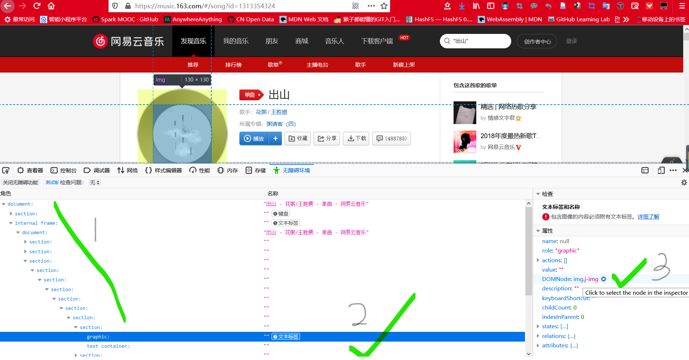
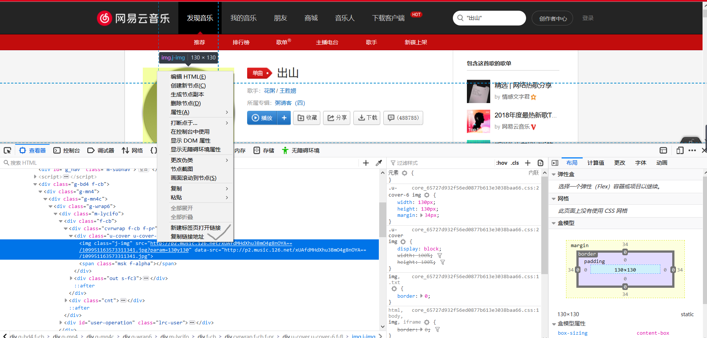

# xinetzone.github.io

刘新伟的博客

[](https://github.com/xinetzone/xinetzone.github.io/issues) [](https://github.com/xinetzone/xinetzone.github.io/network) [](https://github.com/xinetzone/xinetzone.github.io/stargazers) [](https://github.com/xinetzone/xinetzone.github.io/blob/master/LICENSE) [](http://hits.dwyl.io/xinetzone/xinetzone.github.io)   [](https://github.com/xinetzone/xinetzone.github.io/graphs/contributors) [](https://github.com/xinetzone/xinetzone.github.io/watchers)

本项目基于 [blinkfox/hexo-theme-matery](https://github.com/blinkfox/hexo-theme-matery) 修改了一个 matery 主题网站的搭建的模板。

## 如何使用

1. `star` 本项目之后，可以直接`fork`一份源码到您的仓库，然后  `clone` 到本地磁盘
2. 安装 [Git](https://git-scm.com/downloads)，[nodeJS](https://nodejs.org/en/)，[yarn](https://yarnpkg.com/en/docs/install#windows-stable)
3. 在本地博客仓库进入到 `docs/` 目录，运行 `yarn install` 命令安装依赖包
4. 仍然在 `docs/` 目录下，运行 `hexo s` 便可在本地预览网站。
5. 修改配置 `docs/_config.yml` 和 `docs/themes/matery/_config.yml` 信息，改成您自己的信息
6. 替换 `docs/themes/matery/source/medias/reward` 之下的二维码为您自己的
7. 运行命令`hexo  clean`（清除生成文件），`hexo g`（生成网页）， `hexo  s`（本地预览），`hexo d`（部署），详细教程可参考 Hexo 官方网站：[写作](https://hexo.io/zh-cn/docs/writing)

因为本网站是支持多语种的（详细内容见 [多语种的网站](https://hexo.io/zh-cn/docs/permalinks.html)），所以当您建立新文章时，最好使用如下格式：

```sh
$ hexo new "Hello World" --lang zh-CN
# => source/_posts/zh-CN/Hello-World.md
```

其中 `zh-CN` 表示简体中文。

## 自定义主题

您可以修改一些主题设置：

### 1 修改网站的友情链接

修改 `docs/source/_data/friends.json`，比如：

```json
{
    "avatar": "https://xinetzone.github.io/medias/avatars/cnblogs.jpg",
    "name": "写意生活",
    "introduction": "博客园",
    "url": "https://www.cnblogs.com/q735613050/",
    "title": "欢迎进入个人博客"
}
```

其中 `"avatar"` 是友情链接的图标，放在 `themes/matery/source/medias/avatars/cnblogs.jpg` 之下。

### 2 在主页添加音乐播放

在 `themes/matery/source/medias/` 目录下创建 `music/` 目录，并将需要的音乐放进入；接着修改文件 `docs/source/_data/musics.json`。比如：

```json
{
    "name": "出山",
    "artist": "花粥",
    "url": "/medias/music/出山.mp3",
    "cover": "/medias/music/avatars/chushan.jpg"
}
```

其中 `"name"`，`"artist"`，`"cover"` 分别表示歌曲名字，歌者，封面。歌曲的封面的获取可以使用如下方法（firefox 浏览器）：

首先，进入网易云音乐的网页：<https://music.163.com/>，搜索您想要的歌曲，比如："出山"，然后按键 `F12`，弹出如下界面：


接着选择 `无障碍环境`，然后按照下图指示找到 `DOMNode:img.j-img` 并用鼠标点击：



接着，可在下图的对应位置找到封面的链接：



最后，将链接的 `?param=130y130` 部分删除，便可直接保存封面图片了。

## 可能存在的问题

### 1. RPC failed

当您使用 `git clone` 克隆本仓库，而不是使用 `git clone --recurse` 时，如若报下面的错误：

```sh
error: RPC failed; curl 18 transfer closed with outstanding read data remaining
ffatal: the remote end hung up unexpectedly
atal: early EOF
fatal: index-pack failed
```

可以在终端输入如下命令解决：

```sh
$ git config --global http.postBuffer 524288000
```

如果使用过程中有什么问题可以在文章最后评论区**留言和讨论**，如果觉得文章有用，请:smile:打赏按键：

<p align="center">


## 未完成计划

查看 hits：<http://hits.dwyl.io/>

- [ ] 学习[给自己的博客加上看板娘——Live2d蕾姆 | 雷姆](https://zhuanlan.zhihu.com/p/35351118)